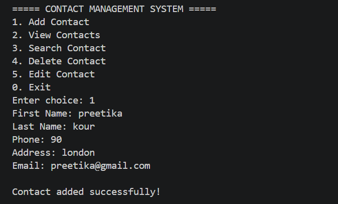
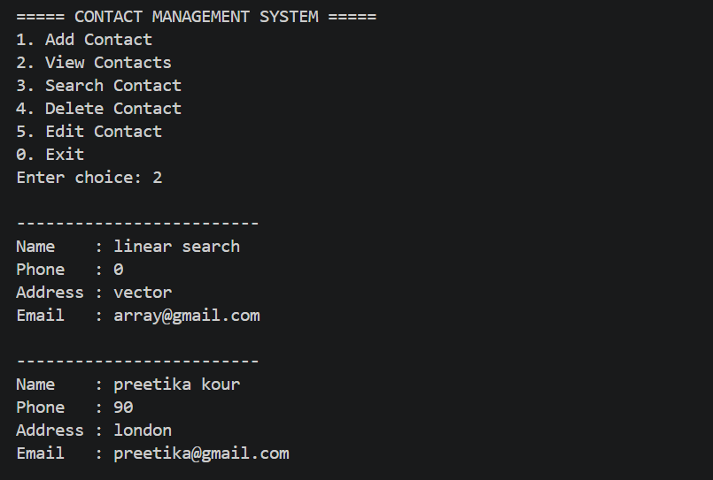
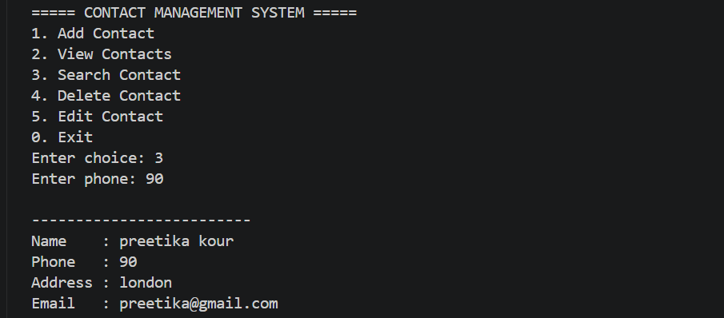
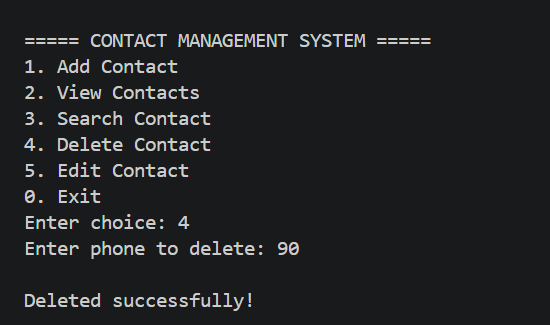

# Contact Management System

A **C++ CLI-based Contact Management System** that allows users to add, search, edit, delete, and store contacts permanently using file handling.

---

# Project Overview

This project is a menu-driven application developed in C++ that helps manage contact records efficiently through the terminal.

The application supports:
- adding contacts
- viewing all contacts
- searching contacts
- editing contact details
- deleting contacts
- persistent file storage

All contact data is stored in a text file so that data remains saved even after closing the application.

---

# Features

- Add new contacts
- View all saved contacts
- Search contacts by phone number
- Edit existing contact details
- Delete contacts
- Persistent storage using file handling
- Duplicate phone number detection
- Menu-driven CLI interface
- Dynamic contact storage using STL vectors
- Clean formatted output display

---

# Contact Information Stored

Each contact stores:
- First Name
- Last Name
- Phone Number
- Address
- Email

---

# Data Structures & Algorithms Concepts Used

## Data Structures
- Vectors (`std::vector`)
- Arrays (conceptually for storage handling)

---

## DSA Concepts
- Linear Search
- Dynamic Data Storage
- CRUD Operations
- Iterator-based Deletion
- Data Traversal
- Sequential Access
- Duplicate Detection Logic

---

# C++ Concepts Used

- Classes & Objects
- Encapsulation
- Functions
- STL Containers
- File Handling
- Input/Output Streams
- Loops & Conditionals
- String Handling
- Iterators
- References
- Const Functions

---

# File Handling Concepts

The project uses:
- `ifstream`
- `ofstream`

to:
- save contacts into files
- load contacts automatically during startup

Contact data is stored in:

```text
contacts.txt
```

using pipe-separated formatting.

Example:

```text
John|Doe|9876543210|New York|john@gmail.com
```

---

# Functionalities

| Option | Function |
|---|---|
| 1 | Add Contact |
| 2 | View Contacts |
| 3 | Search Contact |
| 4 | Delete Contact |
| 5 | Edit Contact |
| 0 | Save & Exit |

---

# Project Structure

```text
contact_management_system/
│
├── cms.cpp
├── contacts.txt
├── README.md
└── output/
    ├── 01-add-contact.png
    ├── 02-view-contacts.png
    ├── 03-search-contact.png
    └── 04-delete-contact.png
```

---

# Screenshots

## Add Contact


## View Contacts


## Search Contact


## Delete Contact


---

# Technologies Used

- C++
- STL
- File Handling
- Object-Oriented Programming

---

# Build & Run

## Compile

```bash
g++ -std=c++17 -O2 -o cms cms.cpp
```

## Run

```bash
./cms
```

### Windows

```bash
cms.exe
```

---

# Learning Outcomes

This project demonstrates:
- implementation of CRUD operations
- practical use of STL vectors
- file handling in C++
- object-oriented programming concepts
- iterator usage
- handling formatted input/output
- dynamic data management

---

# Future Improvements

- Password protection
- GUI version using Qt or SDL
- Contact sorting
- Search by name/email
- Export contacts to CSV
- Contact groups/categories
- Phone number validation
- Better error handling

---

# Author

**Kourpreetika**